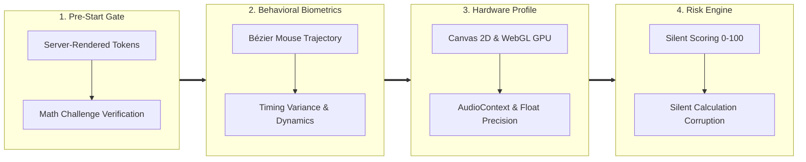

# Hi there, I'm Triis 👋

  

> **Full-Stack Engineer** specializing in high-performance web applications, distributed Go automation, and application security.  
> _"A developer who understands how systems get broken builds systems that don't."_

---

### 📊 Key Highlights & Impact

| 🛡️ Anti-Fraud Engine | ⚡ High Concurrency | 🚀 Web Performance | 🔒 Code Protection |
| :---: | :---: | :---: | :---: |
| **13-Layer Engine** (~37K LOC) | **10K+ Goroutines** | **100/100 Lighthouse** | **5-Layer AST Pipeline** |
| Behavioral Biometrics & Scoring | Socket-Level Automation | Mobile & Desktop Optimized | Edge Shards & Zero-Trace |

---

🇻🇳 <b>Xem bản tóm tắt năng lực bằng Tiếng Việt (Dành cho nhà tuyển dụng)</b>

 

- **Định vị**: Kỹ sư Full-Stack Web kiêm Chuyên gia Bảo mật Ứng dụng & Chống Gian lận (AppSec / Anti-Fraud).
- **Điểm mạnh cốt lõi**:
  - **Full-Stack Web**: Xây dựng ứng dụng hoàn chỉnh với Next.js 16, React 19, TypeScript, PostgreSQL, tối ưu hiệu năng đạt 100/100 Lighthouse.
  - **Hệ thống chịu tải cao (Golang)**: Xử lý hàng vạn kết nối đồng thời với Goroutines/Channels; điều khiển Chrome DevTools Protocol (`chromedp`) ở mức socket; biên dịch đa nền tảng (Windows/ARM).
  - **Bảo mật ứng dụng & Chống gian lận (Thế mạnh đặc biệt)**: Thiết kế engine chống gian lận 13 lớp (~37,000 dòng code) dựa trên sinh trắc học hành vi (Bézier curves, timing variance), dấu vân tay phần cứng (Canvas/WebGL/AudioContext) và chấm điểm rủi ro ẩn (Silent Risk Scoring).
  - **Dịch ngược & Mạng tầng sâu**: Dịch ngược WebAssembly, phân tích mật mã (ECDH, AES-GCM), tùy biến ClientHello TLS (JA3/JA4) trên raw socket.

---

### 🌐 Live Production Projects

| Project | Stack | Highlights |
| :--- | :--- | :--- |
| **[kiemseo.site](https://kiemseo.site)** | `Next.js 16` · `React 19` · `TypeScript` · `PostgreSQL` · `Prisma` · `Tailwind v4` | ⚡ **Lighthouse 100/100** (Mobile & Desktop) · Zero-downtime deployment · Edge security via Cloudflare Workers |
| **[khoahocne.xyz](https://khoahocne.xyz)** | `Next.js 16` · `React 19` · `TypeScript` · `Prisma` · `SQLite` · `Framer Motion` | Full SSR/SEO optimization · Gamification (ranks, leaderboard) · Google Auth & Dark mode |

---

### 🛡️ Core Specialization: Application Security & Anti-Fraud

| Security Pillar | Technical Implementation & Architecture |
| :--- | :--- |
| **Anti-Cheat & Fraud Engine** | Designed a **13-layer server-side engine** (~37K LOC). Analyzes mouse Bézier curves, touch dynamics, timing variance (StdDev), and `isTrusted` events with strict client/server boundary separation. |
| **Hardware Fingerprinting** | Deep entropy collection: Canvas 2D, WebGL GPU renderer, AudioContext oscillator, float precision — bound to sessions via HMAC. |
| **Silent Risk Scoring** | Dynamic threat scoring (0–100). Flags threats silently without tipping off attackers; corrupts calculations invisibly (**silent failure**) instead of throwing detectable errors. |
| **Code Protection & Anti-Tamper** | Secrets isolated to Cloudflare Workers Edge Gateway; clients receive dynamic byte shards. Automated AST obfuscation (Control-Flow Flattening, RC4 encryption, DevTools getter traps). |
| **Protocol & Reverse Engineering** | Reverse-engineered production WebAssembly (`.wasm`) and complex obfuscated JS. Analyzed ECDH P-256 + HKDF + AES-GCM handshakes. Built custom TLS JA3/JA4 fingerprints on raw sockets. |

---

### 💻 Systems & Web Architecture

| Domain | Architecture & Capabilities |
| :--- | :--- |
| **Full-Stack Architecture** | Production SaaS with **Next.js App Router, React 19, TypeScript**. Multi-layer caching, AVIF/WebP assets, variable fonts, and robust data modeling with Prisma & PostgreSQL. |
| **High-Concurrency Systems (Go)** | Distributed automation engines managing **tens of thousands of concurrent connections** via Goroutines & Channels. Direct Chrome DevTools Protocol (`chromedp`) socket orchestration. Cross-compiled for Windows x64 and Android ARM64/ARMv7. |
| **DevOps & Infrastructure** | Linux VPS, Nginx reverse proxy, PM2 zero-downtime reload, Docker containers, Cloudflare Workers, automated SSL renewal, and health check rollback systems. |

---

### 🛠️ Tech Stack

#### Languages

  
  
  
  
  

#### Frontend & Performance

  
  
  
  
  

#### Backend & Infrastructure

  
  
  
  
  
  
  

#### Security & Research

  
  
  
  
  
  

